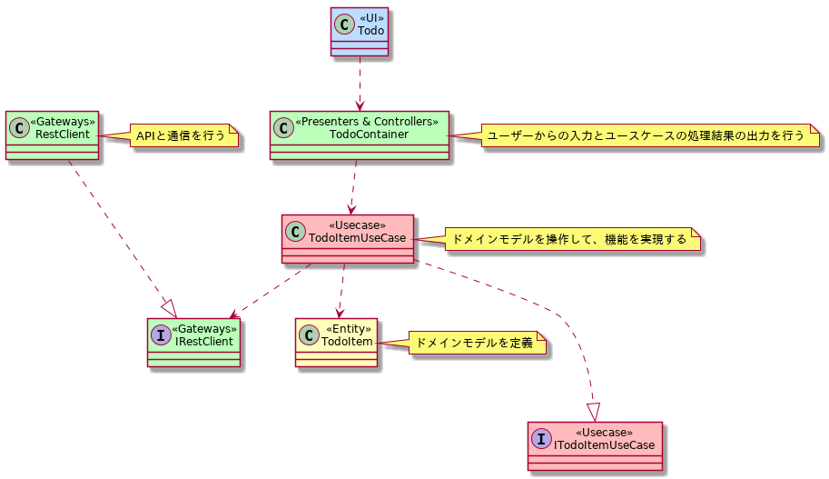

# :ballot_box_with_check: TodoアプリのClean Architecture実装例


## :gift: 機能
- タスクを追加する
- タスクを完了済みにする
- タスクを削除する

## :arrow_forward: 使い方
```bash
# API
$ cd api
$ npm install
$ npm start

# App
$ cd app
$ npm install
$ npm start
```

### Dockerを使用した起動方法
Dockerを使用した場合は起動が遅い場合があります。

```bash
$ docker-compose build
$ docker-compose up
```

## :art: クラス図


## :memo: Licence
MIT
