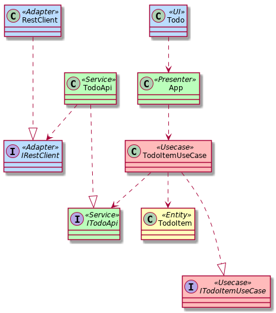

# :ballot_box_with_check: Clean Architecture Todo Example
:construction: [WIP] An implementation example of the Todo app using Clean Architecture.

## :whale: Usage
```bash
$ docker-compose build
$ docker-compose up
```

## :art: Class Diagram


## :memo: Licence
MIT
